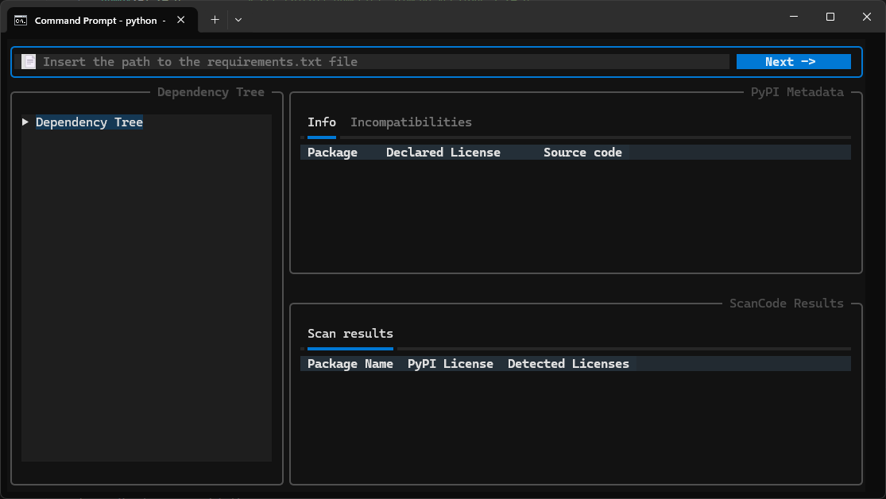

# LicenseHierarchy

A toolchain for building and analyzing the dependency tree of a Python project from its requirements. Includes software license analysis (scancode), license compatibility verification.

## Features

- **Dependency Tree Construction** – Builds a complete tree of dependencies (including transitive ones)
- **PyPI Metadata Retrieval** – Fetches license information from PyPI
- **License Compatibility Check** – Verifies compatibility between licenses using a compatibility matrix
- **Source Code Inspection** – Compares the license declared on PyPI with the one found in the original repository

 \


## Requirements

### Python Dependencies

The projects' dependencies are reported in `src/requirements-dev.txt`; these will be downloaded automatically during the installation process

To install, head to the **[Release Tab](https://github.com/License-Compliance-Group/LicenseSentinel/releases)** and follow the steps reported in the release you wish for.

Alternatively, you may download the latest version released on PyPi with the following command:  
```bash
python -m pip install --index-url https://test.pypi.org/simple/ --extra-index-url https://pypi.org/simple license-hierarchy
```

## Usage

Once installed, you can run LicenseHierarchy by typing the following command:

```bash
license-hierarchy
```  

To use the tool, provide the path of the `requirements.txt` file containing the dependencies of your project in the text box.  
Select the license under which your project will be released, and wait for the dependencies specified in `requirements.txt` in the venv.


## Project Structure

```
src/license_hierarchy
├── entities/           # Domain layer: models & abstract interfaces
├── analyzer/           # Business logic layer
├── infrastructure/     # I/O layer: HTTP, filesystem, processes
├── interface/          # UI layer: GUI & controller
└── licensesentinel.py  # Entrypoint
```

## License

See [LICENSE](LICENSE) for details.